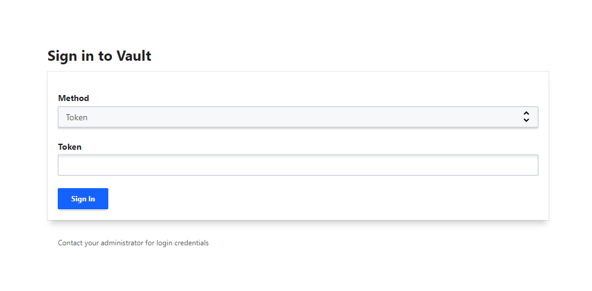
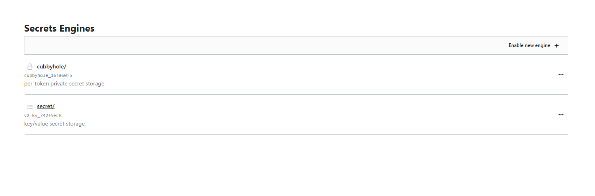
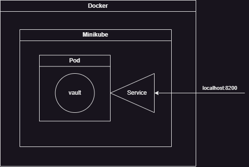

University: [ITMO University](https://itmo.ru/ru/) \
Faculty: [FICT](https://fict.itmo.ru) \
Course: [Introduction to distributed technologies](https://github.com/itmo-ict-faculty/introduction-to-distributed-technologies) \
Year: 2023/2024 \
Group: K4113с \
Author: Nesterenko Mikhail Yurievich \
Lab: Lab1 \
Date of create: 17.10.2023 \
Date of finished: <none>

## Запуск minikube
    minikube start

## Скачивание образа vault
    docker pull vault:1.13.3

## Создаем манифест
``` yaml
apiVersion: v1               # используемая весрия API k8s
kind: Pod                    # создаем под
metadata:                    # дополнительные данные для идентификации
  name: vault                # имя пода
  labels:                    # метки пода
    app: vault               # метка
spec:                        # спецификация пода
  containers:                # список контейнеров в поде
  - name: vault              # имя контейнера
    image: vault:1.13.3      # запускаемый образ в контейнере
    ports:                   # желаемые порты
      - containerPort: 8200  # используемый порт в контейнере
```

## Запуск контейнера и создание пода по манифесту
    kubectl apply -f vault.yaml

## Создание сервиса для перенаправления порта
    kubectl expose pod vault --type=NodePort --port=8200

## Перенаправляем порт
    kubectl port-forward service/vault 8200:8200

## Смотрим логи запуска vault
    kubectl logs vault

## Лог с данными для входа

    2023-10-17T19:00:51.750Z [INFO]  core: successful   mount: namespace="" path=secret/ type=kv version=""
    WARNING! dev mode is enabled! In this mode, Vault runs  entirely in-memory
    and starts unsealed with a single unseal key. The root  token is already
    authenticated to the CLI, so you can immediately begin  using Vault.

    You may need to set the following environment variables:

    $ export VAULT_ADDR='http://0.0.0.0:8200'

    The unseal key and root token are displayed below in case you want to
    seal/unseal the Vault or re-authenticate.

    Unseal Key: *****************
    Root Token: *****************

## Открываем [vault](http://localhost:8200/ui/vault/secrets)

## Заходим под секретным ключом

## Схема организации контейнеров и сервисов
