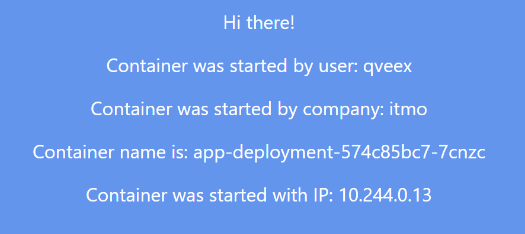
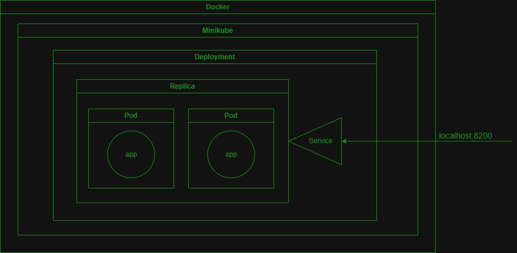

University: [ITMO University](https://itmo.ru/ru/) \
Faculty: [FICT](https://fict.itmo.ru) \
Course: [Introduction to distributed technologies](https://github.com/itmo-ict-faculty/introduction-to-distributed-technologies) \
Year: 2023/2024 \
Group: K4113с \
Author: Nesterenko Mikhail Yurievich \
Lab: Lab2 \
Date of create: 19.10.2023 \
Date of finished: <none>

## Скачивание образа приложения
    docker pull ifilyaninitmo/itdt-contained-frontend:master

## Создаем манифест
``` yaml
apiVersion: apps/v1
kind: Deployment
metadata:
  name: app-deployment
spec:
  replicas: 2
  selector:
    matchLabels:
      app: app-deployment
  template:
    metadata:
      labels:
        app: app-deployment
    spec:
      containers:
        - name: app-react
          image: ifilyaninitmo/itdt-contained-frontend:master
          env:
            - name:  REACT_APP_USERNAME
              value: 'qveex'
            - name:  REACT_APP_COMPANY_NAME
              value: 'itmo'
          ports:
            - name: container-port
              containerPort: 3000

---

apiVersion: v1
kind: Service
metadata:
  name: app-service
spec:
  type: NodePort
  selector:
    app: app-deployment
  ports:
  - port: 2000
    targetPort: container-port
```

## Запуск контейнера и создание пода с сервисом по манифесту
    kubectl apply -f deployment.yaml

## Пробросим порт
    kubectl port-forward service/app-service 8200:2000

## Смотрим логи запуска vault
    kubectl logs vault

## Узнаем заупущенные контейнеры

    kubectl get pods
```
NAME                             READY   STATUS    RESTARTS      AGE
app-deployment-574c85bc7-7cnzc   1/1     Running   0             77s
app-deployment-574c85bc7-w7tbg   1/1     Running   0             75s
vault                            1/1     Running   1 (46m ago)   45h
```

## Посмотрим логи контейнеров
1. `app-deployment-574c85bc7-7cnzc`
```
Builing frontend
Browserslist: caniuse-lite is outdated. Please run:
    npx update-browserslist-db@latest
    Why you should do it regularly: https://github.com/browserslist/update-db#readme
Browserslist: caniuse-lite is outdated. Please run:
    npx update-browserslist-db@latest
    Why you should do it regularly: https://github.com/browserslist update-db#readme
build finished
Server started on port 3000
```
2. `app-deployment-574c85bc7-w7tbg`
```
Builing frontend
Browserslist: caniuse-lite is outdated. Please run:
    npx update-browserslist-db@latest
    Why you should do it regularly: https://github.com/browserslist/update-db#readme
Browserslist: caniuse-lite is outdated. Please run:
    npx update-browserslist-db@latest
    Why you should do it regularly: https://github.com/browserslist update-db#readme
build finished
Server started on port 3000
```

## Открываем сайт

## Схема организации контейнеров и сервисов
