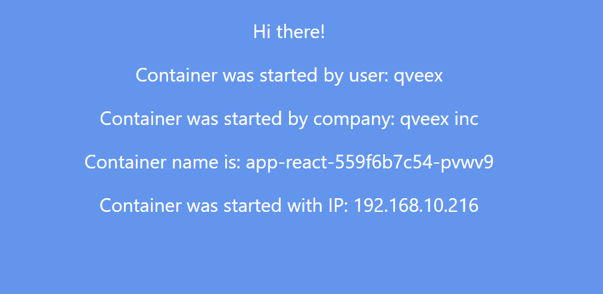
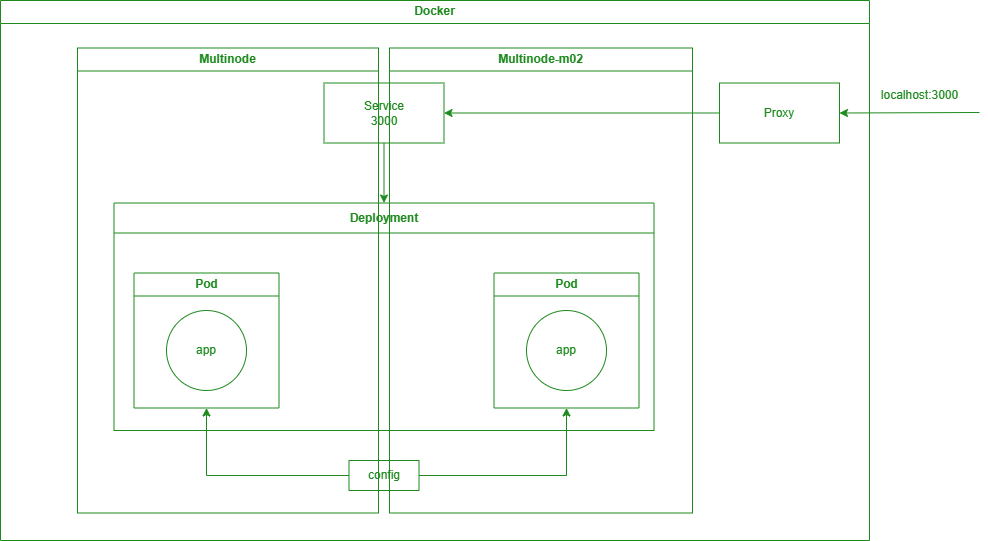

University: [ITMO University](https://itmo.ru/ru/) \
Faculty: [FICT](https://fict.itmo.ru) \
Course: [Introduction to distributed technologies](https://github.com/itmo-ict-faculty/introduction-to-distributed-technologies) \
Year: 2023/2024 \
Group: K4113с \
Author: Nesterenko Mikhail Yurievich \
Lab: Lab4 \
Date of create: 22.11.2023 \
Date of finished: <none>

## Устанавливаем `Calico` для Windows
    Invoke-WebRequest -Uri "https://github.com/projectcalico/calico/releases/download/v3.26.4/calicoctl-windows-amd64.exe" -OutFile kubectl-calico.exe

## Запускаем 2 ноды `minikube` с `Calico`
    minikube start --network-plugin=cni --cni=calico --nodes 2 -p multinode

## Проверяем количество нод
    $ kubectl get nodes
```
NAME            STATUS   ROLES           AGE    VERSION
multinode       Ready    control-plane   117s   v1.27.4
multinode-m02   Ready    <none>          81s    v1.27.4
```

## Проверяем количество подов `calico`
    $ kubectl get pods -l k8s-app=calico-node -A
```
NAMESPACE     NAME                READY   STATUS    RESTARTS   AGE
kube-system   calico-node-b2n8q   1/1     Running   0          89s
kube-system   calico-node-m4d5v   1/1     Running   0          110s
```
## Укажем `label` для нод
    kubectl label node multinode rack=1 && kubectl label node multinode-m02 rack=2

## Проверим указанные `label` для нод
    $ kubectl get nodes -l rack=1
```
NAME        STATUS   ROLES           AGE    VERSION
multinode   Ready    control-plane   4m6s   v1.27.4
```

## Создаем `Calico` манифест
``` yaml
apiVersion: projectcalico.org/v3
kind: IPPool
metadata:
  name: rack-1-ippool
spec:
  cidr: 192.168.10.0/24
  ipipMode: Always
  natOutgoing: true
  nodeSelector: rack == "1"

---

apiVersion: projectcalico.org/v3
kind: IPPool
metadata:
  name: rack-2-ippool
spec:
  cidr: 192.168.20.0/24
  ipipMode: Always
  natOutgoing: true
  nodeSelector: rack == "2"
```

## Удалим `IPPOOL` по умолчанию
    kubectl-calico delete ippools default-ipv4-ippool

## Применяем манифест
    $ kubectl-calico create -f -< calico.yaml --allow-version-mismatch
```
Successfully created 2 'IPPool' resource(s)
```

## Проверяем `IPPOOL`
    $ kubectl-calico get ippools --allow-version-mismatch
```
NAME            CIDR              SELECTOR
rack-0-ippool   192.168.10.0/24   rack == "1"
rack-1-ippool   192.168.20.0/24   rack == "2"
```

## Скачивание образа приложения
    docker pull ifilyaninitmo/itdt-contained-frontend:master

## Создаем `configMap`
``` yaml
apiVersion: v1
kind: ConfigMap
metadata:
  name: config-map
data:
  REACT_APP_USERNAME: "qveex"
  REACT_APP_COMPANY_NAME: "qveex inc"
```

## Создаем `deployment` и `service`
``` yaml
apiVersion: apps/v1
kind: Deployment
metadata:
  name: app-react
spec:
  replicas: 2
  selector:
    matchLabels:
      app: app-react
  template:
    metadata:
      labels:
        app: app-react
    spec:
      containers:
        - name: app-react
          image: ifilyaninitmo/itdt-contained-frontend:master
          envFrom:
            - configMapRef:
                name: config-map

---

apiVersion: v1
kind: Service
metadata:
  name: app-service
spec:
  type: LoadBalancer
  ports:
    - port: 3000
      targetPort: 3000
      protocol: TCP
  selector:
    app: app-react
```

## Приняем `deployment` и `service`
    $ kubectl apply -f configMap.yaml
    $ kubectl apply -f deployment.yaml

## Узнаем заупущенные ноды
    $ kubectl get pods -o wide
```
NAME                         READY   STATUS    RESTARTS        AGE   IP               NODE            NOMINATED NODE   READINESS GATES
app-react-559f6b7c54-njp28   1/1     Running   0               6s    192.168.20.128   multinode-m02   <none>           <none>
app-react-559f6b7c54-q8sb5   1/1     Running   1 (3m50s ago)   11m   192.168.10.200   multinode       <none>           <none>
```

## Включаем туннелирование
    minikube service app-service

## Открываем сайт


## Container и Container IP
Они могут меняться, так как у нас есть два контейнера и `LoadBalancer` перенаправляет нас на один из них

## Узнаем имя соседнего пода
    $ kubectl exec app-react-559f6b7c54-njp28 -- nslookup 192.168.20.128
```
Server:         10.96.0.10
Address:        10.96.0.10:53

128.20.168.192.in-addr.arpa     name = 192-168-20-128.app-service.default.svc.cluster.local
```

## Ping соседа
    $ kubectl exec app-react-559f6b7c54-njp28 -- ping 192-168-20-128.app-service.default.svc.cluster.local
```
PING 192-168-20-128.app-service.default.svc.cluster.local (192.168.20.128): 56 data bytes
64 bytes from 192.168.20.128: seq=0 ttl=64 time=0.043 ms
64 bytes from 192.168.20.128: seq=1 ttl=64 time=0.072 ms
64 bytes from 192.168.20.128: seq=2 ttl=64 time=0.060 ms
64 bytes from 192.168.20.128: seq=3 ttl=64 time=0.061 ms
```

## Схема организации контейнеров и сервисов
